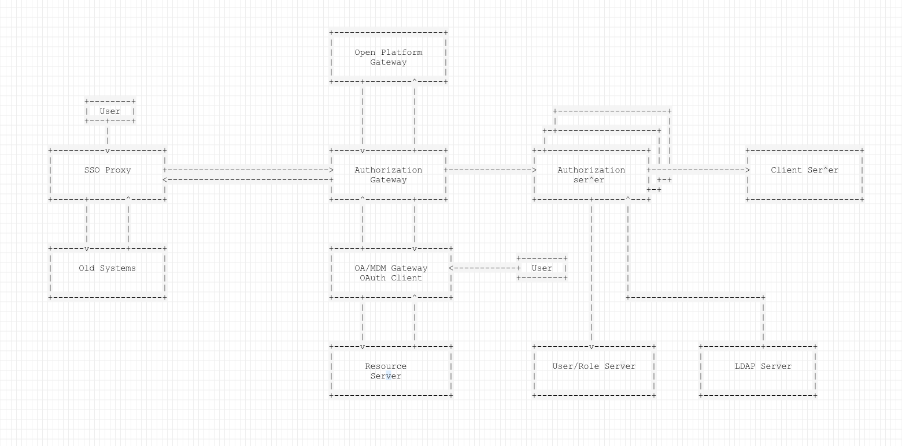

## UAA
> User account and authorization

#### Design

[Architecture Decision Records](docs/architecture/decisions)

#### Architecture

#### Has done:
+ basic design and initial
+ user
+ client
+ sso demo

#### Base todo:
+ multi datasource and client initial
+ jwt rsa token_key
+ cors and session
+ custom login page
+ jwt payload design(multi-tenant ABAC-scope RABC)
+ authorization code persistence for horizontally scaling
+ account
    - change password
    - change email
    - change profile
+ client
    - client register
    - client approve
+ audit design
+ multi authorization provider

#### RoadMap
- [x] 用户中心解决方案与文档记录
- [x] sso-example实现与sso原理解析
- [x] Oauth2客户端管理服务
- [ ] 网关密码登录重构
- [ ] 用户服务重构与UAA功能开发
- [ ] 多租户
- [ ] 非spring应用sso方案
- [ ] sso-proxy方案制定
- [ ] 使用Spring Security5重构授权服务器
- [ ] Oauth2客户端和资源服务器重构

#### Other
test password:

`{bcrypt}$2a$10$d1W72IIEfPvYh36ZxRSrMOGXY1PMW1T8yXL2OVBkrTc6Zofqs90VG`
